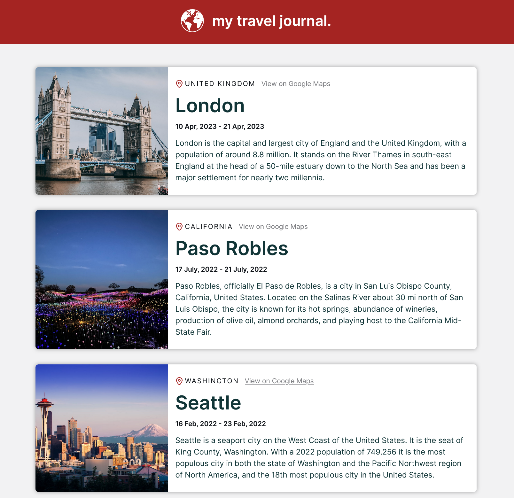

# Travel Journal React Web App - A Scrimba Solo Project

This is a solution to the Scrimba solo project: build a travel journal web app using React. This project features the use of reusable components, props to dynamically display content, and Vite tooling to build a React-based static website.

## Table of contents

- [Overview](#overview)
  - [The requirements](#the-requirements)
  - [Screenshot](#screenshot)
  - [Links](#links)
- [My process](#my-process)
  - [Built with](#built-with)
  - [Useful resources](#useful-resources)
- [Author](#author)

## Overview

### The requirements

- Develop using React
- Utilize a data array in a seperate .js file
- Use the .map() method with props
- Style according to design comp

Personal stretch goals:

- Added mobile/desktop view responsive
- Updated card styling

### Screenshot

### Links

- [Scrimba Scrim URL](https://scrimba.com/scrim/co15e4e88a4f891405caaef47)
- [Live Site URL](https://mellow-chebakia-4b314d.netlify.app/)

## My process

### Built with

- Semantic HTML5 markup
- CSS custom properties
- Flexbox
- CSS Grid
- Mobile-first workflow
- [React](https://reactjs.org/) - JS library

### Useful resources

- [React Docs](https://react.dev/learn) - Outside of the Scrimba curriculum materials leading up to this project, I found the official React documentation an excellent reference.

## Author

- Website - [Matt Pahuta](https://www.mattpahuta.com)
- Twitter/X - [@mattpahuta](https://www.twitter.com/MattPahuta)
- LinkedIn - [Matt Pahuta](www.linkedin.com/in/mattpahuta)